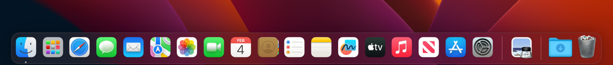

In this lab, we will establish some fundamental concepts that are important for working with computers:

- Basic definition of a computer
- Introduction of the concept of an **Operating System**
- Introduction of the **Dock application** in MacOS
- Introduction of the **Finder application** in MacOS
- Introduction of the concept of a **File System**
- Introduction of the concept of a **Command Interpreter**
- Introduction of the **Terminal application** in MacOS
- Introduction of basic command line navigation in MacOS using the commands pwd, ls, man and cd
- Introduction of how to list the contents of a working direcotry.

This lesson is meant to introducre the Finder and the Terminal, which will be key tools you will use in your Security education.


Take a moment and describe what a computer is.  Write your explanation down.  After you are done, continue reading this lab and compare it with the definition I provide.  When you do, compare the differences between our descriptions.  This will help you understand where you need to grow in your understanding of computing fundamentals.

# What is a computer?

A computer is **hardware** that is able to run **software**.

A computer has an **operating system**, which is responsible for managing the interactions between software with the computer's hardware.

# What is an Operating System?
Microsoft Windows, MacOS, iOS, Android and Linux are examples of "**Operating Systems**."

You can interact with a computer through a graphic user interface (**GUI**) or a **Command Interpreter**.  Microsoft Windows, MacOS, iOS and Android are operating systems with a graphic user interface.  On Windows, you can run the applications named  "Powershell" or "cmd.exe" as a command interpreter.  On MacOS, the Terminal is the command interpreter.   Android and iOS don't  have a command line available by default- most users only interact with Android & iOS via the GUI.  


You can explore the file system on a mac by opening an app called the "**Finder**."  

## The MacOS Dock

There is a display element called the "**Dock**" at the bottom of the Mac's desktop:


## The MacOS Finder

On a Mac, the Finder is in the dock by default and has an icon that looks like this:


Double click on the Finder icon to launch the finder.  The default finder view hides some valuable information.  In it's initial presentation, it likely shows "recent files" like this:


The default view of the finder prevents you from seeing the file system structure clearly.  I will make some changes to the finder settings which will make it easier to see the filesystem.  For starters, let's change the view from Icons to List.  The menu where you can change the view is located here:

### Changing the finder view to list mode and unhiding the hard drive.

If your window is compressed, the view menu looks like this:


We need to change the view to List view by clicking on this icon:


The List view presents slightly differently if your finder is compressed:


Next, we need to unhide the hard drive via the finder settings.  You can open the finder settings by clicking finder at the top of the menu bar, and then selecting settings:


The settings menu will open.  Across the top, it lists "General", "Tags", "Sidebar" and "Advanced".  Click on Sidebar, and the menu will look like this:


In the locations setion, make sure that "Hard Disks" is changed to have a blue checkmark.  Close the menu.  When you look at the finder, you'll now see a location labeled "MacOS" (the name may be different if you customized it during mac setup)


When you click on MacOS, you'll see something similar to this screenshot, which shows you a view of the / directory of the **File System**:


# What is a File System?
A computer has a **file system**, which is a hierarchical storage structure of files, directories & executable programs.   If you use a word processor to create documents, you are storing files in locations on the computer somewhere within the file system.  You are launching the wordprocessor application from somewhere within the file system.  You can think of the file system like an organized filing cabinet filled with folders that have documents in them.  

On Linux computers and MacOS, there is a directory called / and it pronounced "root."  Everything on the file system is stored somewhere under /.  

The MacOS view in the finder represents the / folder of the system.  If you open the drive, you should see something like the following:


This view of the root filesystem is incomplete, however.  As you experieced earlier when we changed the finder settings to show the hard disk, there are  default settings of the Finder which hide aspects of the system.  Graphic User Interfaces designed to keep beginners from accidentally damaging the system in it's default state.  As a result, they're not always the best tool for experts to use.  When we're doing security work, we're going to spend a lot of time using a Command Interpeter.

# What is a Command Interpreter?

Wikipedia defines a Command Interpreter as "a blanket term for a certain class of programs designed to read lines of text entered by a user, thus implementing a command-line interface."  It's a simple tool that accepts commands typed by the user, performs operations and presents results of those operations.  

# What is Spotlight Search?

Spotlight can help you quickly find apps, documents, emails, and other items on your Mac.  Apple has an [Apple support page](https://support.apple.com/guide/mac-help/search-with-spotlight-mchlp1008/mac) that provides more detail on the features of Spotlight Search.  We can use spotlight search to quickly launch applications if we know their name.  

On your Mac, if you press the "Command" and "Space" keys simultaneously, Spotlight Search will show in the middle of your screen.  


You can type "terminal" to launch Mac's Command Interpreter.


The default view of the terminal is something similar to this:


On the left side of the terminal, you'll see the username of the account you're logged into, then an @ sign and finally the hostname of your mac.  In my case, I'm logged into an account called "Test" and the computer I'm logged into is a macbook air with the hostname of Patricks-Air-5.  There's then a "~" (pronounced Til-duh), and then a percentage sign.  The ~ is a signal that tells you you're in your account's home directory, and the % is a signal that the command interpreter you are running is something called zsh (or Z Shell).  There are many different command interpreters you could run, each with subtle differences optimized for different kinds of use cases.  ZSH has some autocomplete and navigation advantages which make it preferred by some advanced users.  

Try typing your first command in the terminal:


```pwd```


 Note that the command is case sensitive- you have to type it in all lower case.


The output was ```/Users/test```.  That probably feels anticlimactic.  What does this command do?  What does /Users/test even mean?  We have to figure it out.  Luckily, there's a hand tool called "man" which will give us a manual for a tool if it's been installed on the system.  Let's type 

```man pwd```

to see what PWD does.


In the description, we see that the PWD utility writes the absolute pathname of the current working directory to the standard output.  If you hit the space bar, the man page skips down a full page.  You can hit the up and down arrows to move through the file one line at a time.  You can it the "b" key to go back and the "q" key to quit out of the man application.
 
We learned that the pwd command expresses where you are currently located in the ***File System***.  

So if the output of pwd is ```/Users/test```, that tells us we are currently in the directory 'test' which is nested within another directory called 'Users' which is also under a directory named '/'.  Take a note of this directory- we'll come back to it later.

Let's try a new command called "ls" :

```ls```


It reported back 8 things.  Let's see what the ls command does with the man tool:


According to the man page, ls lists the contents of a directory.  Notice at the bottom of the page, there is a ```:```.  If you hit the forwardslash key ```/```, you can then type a case sensitive search term.  Let's search for the term ```EXAMPLES```


Hit ```return```


The man page will jump to any sections that match the text.  As you can see, the all uppercase word "EXAMPLES" is highlighted at the top of the page.  If there is more than one instance of the word "EXAMPLES, you can hit the ```n``` key and man will jump through the document to the next instance.  If there are no further instances, the semicolon at the bottom of the page will report Pattern not found.

  


The Examples section of man pages is very helpful.  It will often show additional "command line options" which will produce more informative results.  The man example suggests ```ls -lioF```.   Let's run this command and see it's output:

  

The second column of results gives us some intersting information.  The first thing to note is the 'd' at the beginning of the column.  This tells you that the object that's listed in that row is a Directory.  You can also infer this from the forward slash ```/``` at the end of each entry.  

The ls command has many command line options.  Let's try adding a few extra letters to the command: ```ls -alhioF```

  

You'll see the output is different.  You'll also notice that there are now new entries which start with a "."!  In Unix and Linux systems, you can hide filesystem objects from the standard response by prepending them with a ".".  In the command we used, we included the command line option of -a, which tells ls to include entires that start with a "." in the response.

In addition, some of the files don't have the / at the end of the name.  For those instances, if you look at the second column, you'll see that those entries also don't have the "d" value.  This means that these are files rather than directories.  We now have a better way to explore the file system.  The alhioF command line arguments are a lot to remember- so I try to use the simpler ```ls -alh``` command.  

  

- -a returns files hidden with a . at the beginning of the name
- -l returns "The Long Format" of the entries for each file (try searching the man page of LS for "The Long Format" to learn more)
- -h returns the size of each file in a human readable format (e.g 512B vs 6.0K is telling you the size of the file in bytes or Kilobytes)

Let's circle back to the root directory we explored using the Finder.  We will use the ```cd``` command to change into the root directory:


```cd /```

  

Notice that the command line changed. The ```~``` was replaced with a ```/``` after the command ran.  We asked the interpreter to change to the / directory.  You can change into a directory by typing ```cd``` and then providing a full path to a location.  

Let's now run an ls -alh command from the / directory:


Do you remember what directory we were in when you ran the pwd command?  Let's add that to the cd command and run ls again:


As you can see, the output of ls changes to reflect whatever directory you are in.  You can use the cd command to change directories.  Let's get ourselves back to the / directory with ```cd /``` and compare what root looks like in Finder versus the terminal.

The root directory has more files than we saw in the finder.  Let's compare:


ls -alh root             |  Finder root
:-------------------------:|:-------------------------:
   |   
 

As you can see- the ls output includes Applications, Library, System and Users.  But there are many more files.  You don't see the same set of files in the finder.  This should demonstrate why it is valuable to learn how to work with the command line.  As we work more with the machine, we will explore many commands.  You can find a helpful cheat sheet of macos terminal commands [here](https://github.com/0nn0/terminal-mac-cheatsheet). 


[Apple userguide for Terminal](https://support.apple.com/guide/terminal/welcome/mac)


